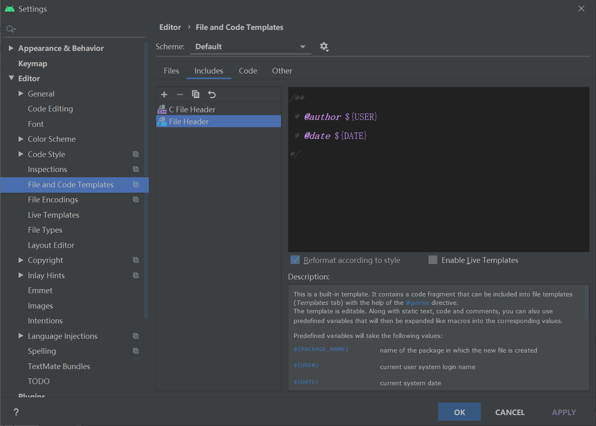
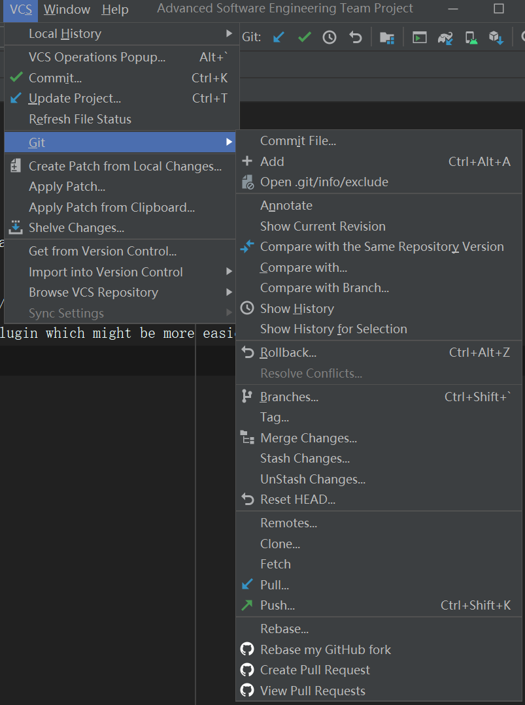

# SoftwareEngProject

## BeforeCoding

* Go file->setting->Editor->File and Code Templates->File Header to set-up a file header for recognize

* Click this link to learn how to use git http://users.sussex.ac.uk/~hh435/ase/week3.txt
* Or just use the Android Studio build-in git plugin which might be more easier

